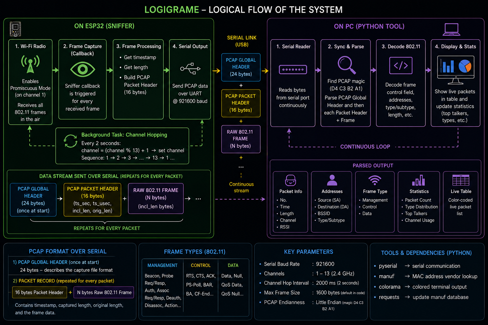
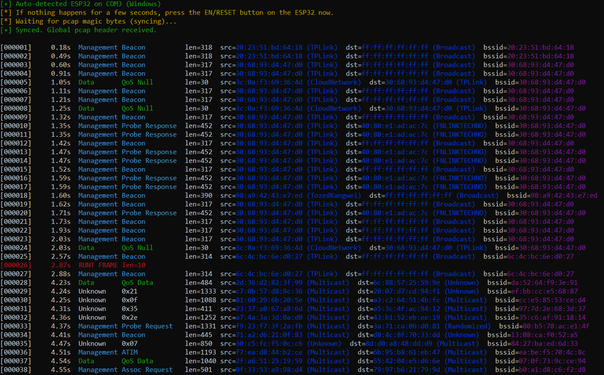

# ESP-Sniffer

A real-time Wi-Fi packet sniffer built on the ESP32. The ESP32 runs in promiscuous mode, captures raw 802.11 frames, and streams them over USB serial in PCAP format to a Python host tool that decodes, classifies, and displays them in a live color-coded terminal view.

---

## System Architecture



The system is split into two halves:

- **ESP32 firmware** — puts the Wi-Fi radio into promiscuous mode, hops channels every 500 ms, wraps every captured frame in a PCAP packet header, and streams the raw bytes over UART at 921600 baud.
- **Python host tool** — syncs to the PCAP magic bytes, reads packet headers and frames, decodes the 802.11 control field, resolves vendor names from MAC addresses, and prints a live colored packet log with periodic statistics.

---

## Live Output



Each line shows:

| Field | Description |
|---|---|
| `[000001]` | Packet number |
| `0.18s` | Elapsed time since capture start |
| `Management` | 802.11 frame category (Management / Control / Data) |
| `Beacon` | Frame subtype |
| `len=318` | Captured frame length in bytes |
| `src=...` | Source MAC address with vendor name |
| `dst=...` | Destination MAC address with vendor name |
| `bssid=...` | BSSID MAC address |

Every 50 packets a summary line prints packet rate and top frame types.

---

## Project Structure

```
ESP-Sniffer/
├── esp/
│   ├── esp.ino          # Arduino entry point (setup / loop)
│   ├── sniffer.cpp      # ESP32 promiscuous sniffer + PCAP serializer
│   └── sniffer.h        # Constants and function declarations
├── assets/
│   ├── logigrame.png    # System architecture diagram
│   └── screenshot.png   # Live terminal output screenshot
├── manuf.txt            # Wireshark OUI/vendor database
├── requirements.txt     # Python dependencies
└── sniffer.py           # Python host tool
```

---

## Requirements

### ESP32 Firmware

- Arduino IDE or PlatformIO
- ESP32 board support package
- Board: any ESP32 development board (tested with CP2102 / CH340 USB-serial chips)

### Python Host Tool

- Python 3.8+

Install dependencies:

```bash
pip install -r requirements.txt
```

| Package | Purpose |
|---|---|
| `pyserial` | Serial communication with the ESP32 |
| `colorama` | Colored terminal output (cross-platform) |
| `manuf` | MAC address OUI vendor lookup |
| `requests` | Downloading updated Wireshark manuf database |

---

## Flashing the ESP32

1. Open `esp/esp.ino` in the Arduino IDE.
2. Select your ESP32 board and the correct COM port.
3. Set the upload baud rate to the IDE default; the sketch itself sets **921600** for serial output.
4. Upload.

The firmware immediately starts capturing and streaming PCAP data once it boots.

---

## Running the Python Tool

### Auto-detect the ESP32 port

```bash
python sniffer.py
```

The tool scores available serial ports by USB VID/PID and description keywords (CP210x, CH340, CH341, CH9102, Silicon Labs, UART) and connects automatically.

### Specify the port manually

```bash
python sniffer.py --port COM5          # Windows
python sniffer.py --port /dev/ttyUSB0  # Linux
python sniffer.py --port /dev/cu.usbserial-0001  # macOS
```

### List available ports

```bash
python sniffer.py --list-ports
```

### Update the vendor database

```bash
python sniffer.py --update 1
```

Downloads the latest Wireshark OUI database from `https://www.wireshark.org/download/automated/data/manuf` and saves it to `manuf.txt`.

---

## How It Works

### ESP32 Side

1. Wi-Fi radio is initialized in station mode and switched to **promiscuous mode**.
2. A promiscuous callback fires for every received 802.11 frame.
3. The callback wraps the frame in a **16-byte PCAP packet header** (`ts_sec`, `ts_usec`, `incl_len`, `orig_len`) and writes it to `Serial` at 921600 baud.
4. A **24-byte PCAP global header** is written once at startup so the Python side can sync.
5. A background channel-hopper cycles through channels 1–13 every **500 ms**.

### Python Side

1. Opens the serial port and waits for the **PCAP magic bytes** (`D4 C3 B2 A1`).
2. Reads and discards the 20 remaining bytes of the global header.
3. Enters a continuous loop: reads the 16-byte packet header, then reads exactly `incl_len` bytes of frame data.
4. Parses the 802.11 **Frame Control** field to extract type, subtype, source/destination/BSSID addresses.
5. Classifies each MAC as Broadcast, Multicast, Randomized, or resolves the OUI vendor name.
6. Prints a color-coded line per packet (cyan = Management, yellow = Control, green = Data).
7. Every 50 packets prints a stats summary (total packets, pkt/s, top 3 frame subtypes).

---

## Key Parameters

| Parameter | Value |
|---|---|
| Serial baud rate | 921600 |
| Channels scanned | 1 – 13 (2.4 GHz) |
| Channel hop interval | 500 ms |
| Max frame size | 1600 bytes |
| PCAP link type | 802.11 (DLT 1) |
| PCAP endianness | Little-endian (magic `D4 C3 B2 A1`) |

---

## Supported 802.11 Frame Types

| Category | Subtypes |
|---|---|
| **Management** | Beacon, Probe Request/Response, Assoc Request/Response, Reassoc Request/Response, Authentication, Deauthentication, Disassociation, Action, ATIM |
| **Control** | RTS, CTS, ACK, PS-Poll, BAR, BA, CF-End |
| **Data** | Data, Null, QoS Data, QoS Null |

---

## Troubleshooting

**Nothing happens after connecting**
Press the **EN/RESET** button on the ESP32. The tool will print a reminder if no data arrives within 5 seconds.

**`[!] Could not auto-detect an ESP32 serial port`**
Run `python sniffer.py --list-ports` to see what is available and pass the port explicitly with `--port`.

**Permission denied on Linux**
```bash
sudo usermod -a -G dialout $USER
```
Log out and back in for the change to take effect.

**`Bad packet length` errors**
The PCAP stream lost sync. The tool will automatically attempt to re-sync to the magic bytes.

---

## License

This project is released for educational and research purposes. Use responsibly and only on networks you own or have explicit permission to monitor.
